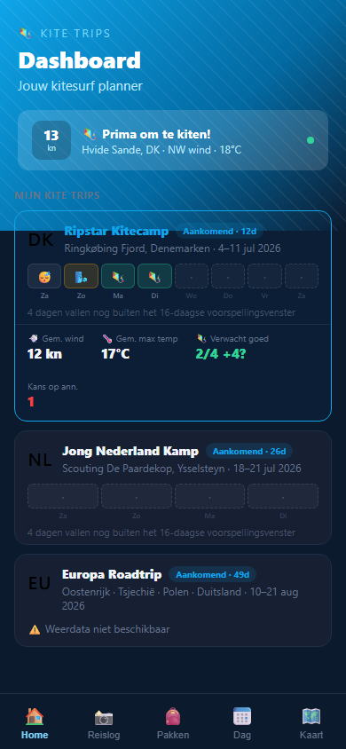
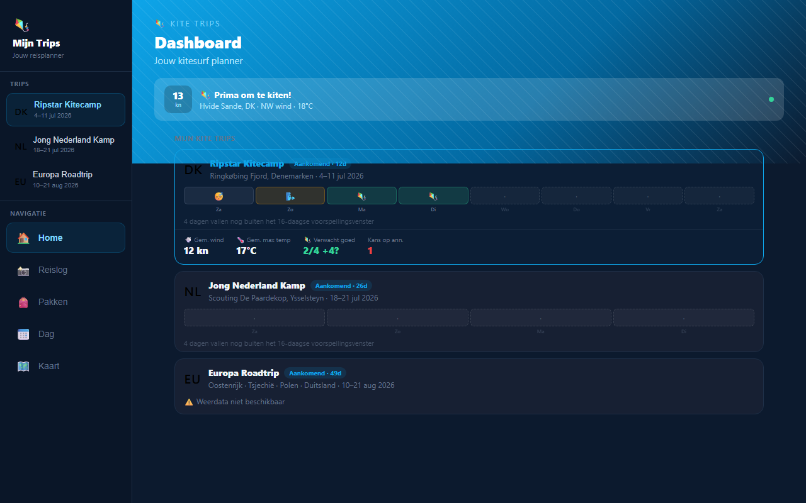
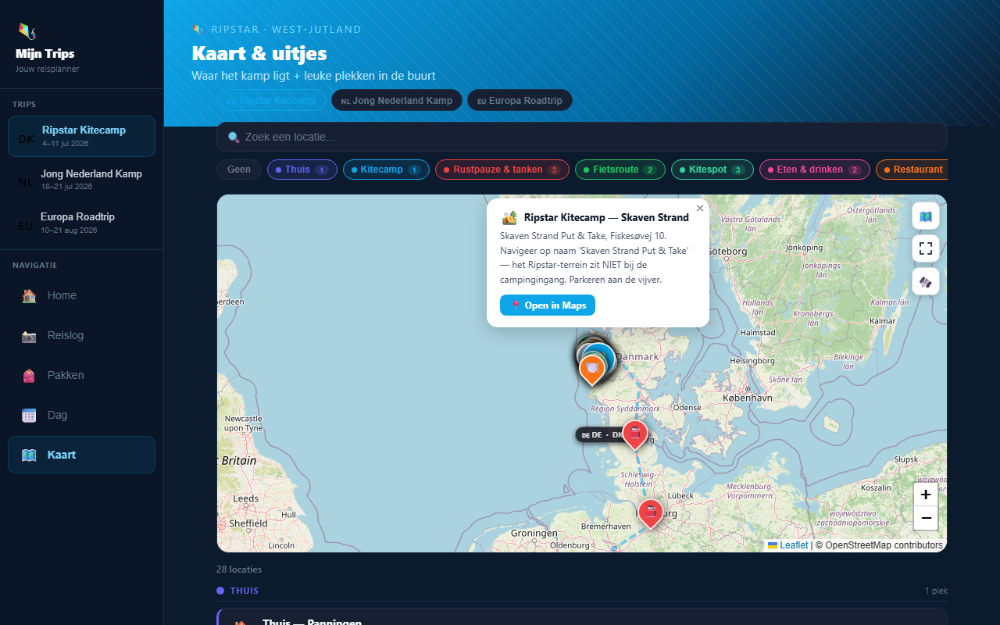
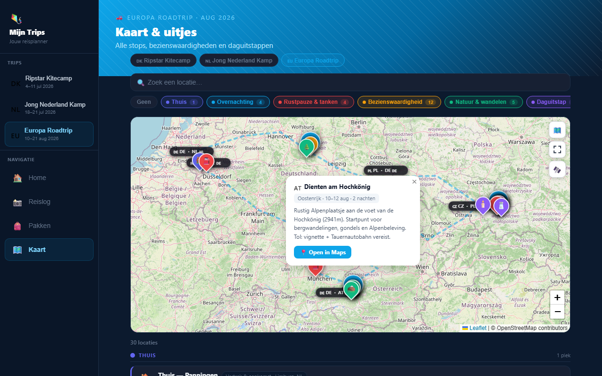
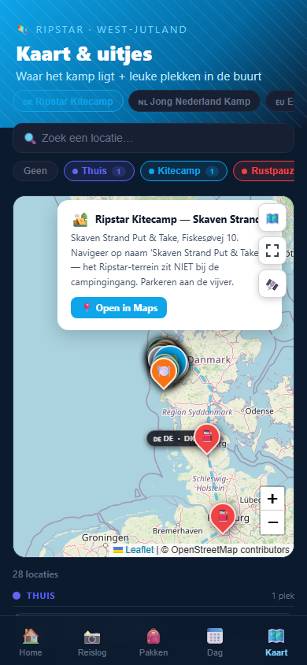
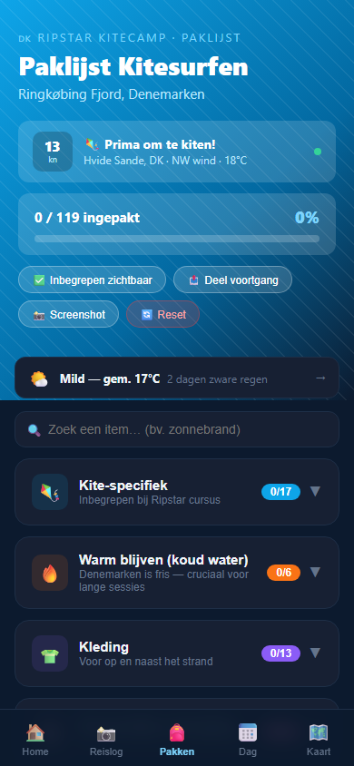
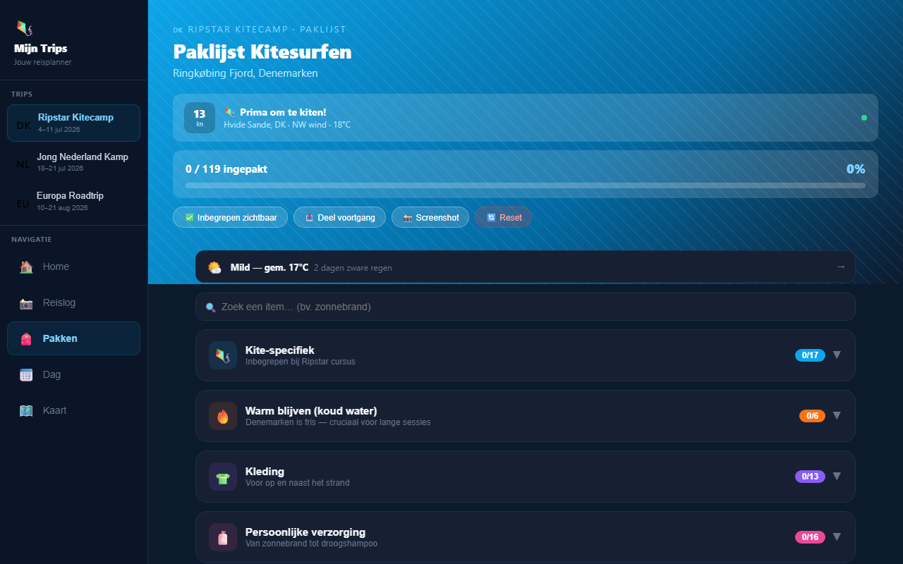
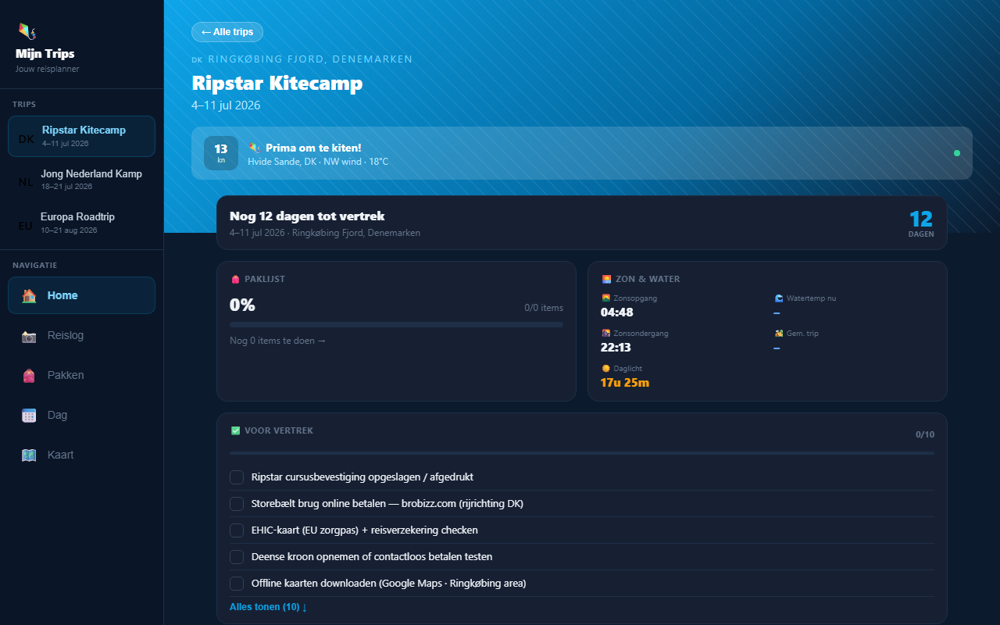
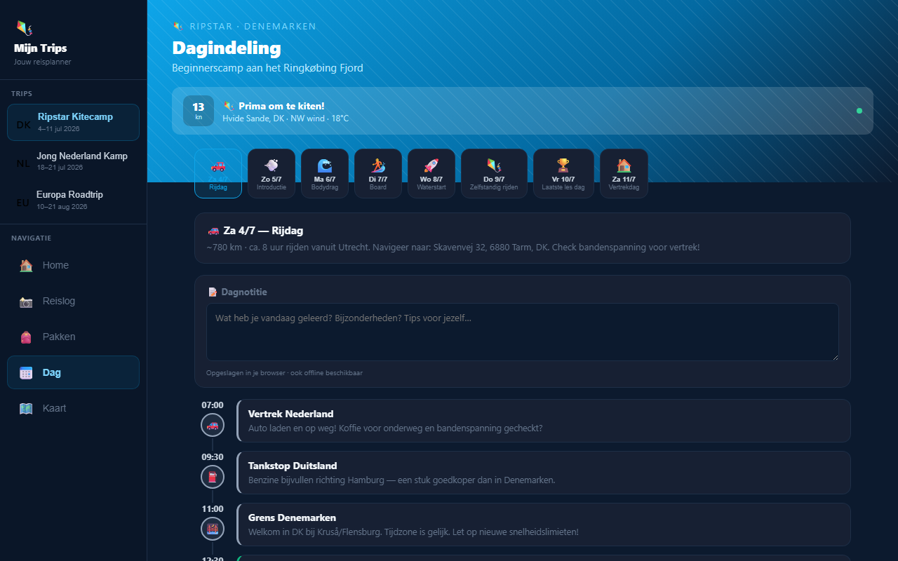
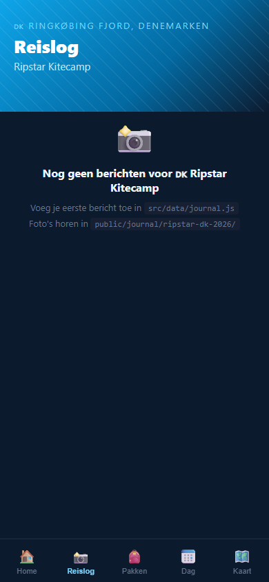

# Mijn Trips

Persoonlijke reisplanner als PWA — meerdere trips, paklijsten, interactieve kaarten, dagindeling en reislog. Werkt offline, installeerbaar op je telefoon.

**Live:** https://rikp777.github.io/mijn-trips/

---

## Views

### Dashboard
Alle aankomende en actieve trips in één overzicht. Per trip een live weerswidget (wind, temperatuur, 7-daagse voorspelling) en een countdown.

| Mobiel | Desktop |
|--------|---------|
|  |  |

---

### Kaart & uitjes
Interactieve Leaflet-kaart met gekleurde markers per categorie, rijroute en fietsroute. Filter op categorie, zoek locaties. Klik een marker → de locatie licht op in de lijst eronder. Wissel van trip via de chips bovenin — de kaart herlaadt zonder terug naar home te springen.

| DK Kitecamp | Europa Roadtrip |
|-------------|-----------------|
|  |  |



---

### Paklijst
Per categorie aftekenen, voortgangsbalk, zoekfunctie. Voortgang delen via de native share-sheet of exporteren als PNG. Live wind-widget bovenin (hetzelfde als dashboard).

| Mobiel | Desktop |
|--------|---------|
|  |  |

---

### Trip detail & dagindeling
Trip-header met countdown en snelkoppelingen. Dagindeling toont een timeline van een typische kamp- of reisdag.

| Trip detail | Dagindeling |
|-------------|-------------|
|  |  |

---

### Reislog
Journaal per trip — voeg berichten en foto's toe tijdens de reis.



---

## Features

### Trips
- Meerdere trips tegelijk — DK kitecamp, Europa roadtrip, Jong Nederland kamp
- Per trip eigen tabs, paklijst, kaart en locaties
- Trip switcher in sidebar (desktop) en kaart-chips (mobiel) — blijft op de huidige tab
- Live trip gemarkeerd in groen in de sidebar, geselecteerde trip in blauw

### Dashboard
- Live winddata van Open-Meteo voor de kitespot — met "kan ik kiten?"-oordeel
- Weersverwachting per dag (emoji + windkracht) voor de komende week
- Countdown tot vertrek per trip

### Kaart
- OpenStreetMap via Leaflet (geen API-key nodig)
- Pre-baked rijroutes en fietsroutes — geen runtime OSRM-calls, laadt direct
- Pre-baked landsgrenzen (Overpass, admin_level 2) — NL/DE, DE/DK, DE/AT, DE/CZ, CZ/PL, PL/DE
- Categorie-filters (chips) en zoekbalk
- Klik marker → highlight + scroll in de lijst eronder
- "Toon op kaart" in lijst → fly-to + highlight marker
- Satellietkaart wissel

### Paklijst
- 119 items verdeeld over categorieën (kite-specifiek, kleding, EHBO, …)
- Zoeken door alle items
- Voortgang bewaren in localStorage (offline)
- Delen via Web Share API, exporteren als PNG screenshot
- Haptische feedback bij afvinken (mobiel)
- Confetti als alles ingepakt is

### PWA / mobiel
- Installeerbaar als app (Add to Home Screen)
- Offline bruikbaar via service worker
- Bottom tab-navigatie op mobiel, vaste sidebar op desktop

---

## Tech stack

| | |
|--|--|
| Framework | React 18 + Vite |
| Kaart | Leaflet 1.9 + OpenStreetMap |
| Stijl | Inline styles, dark theme |
| Routing | Hash-based (`#?tab=map&trip=…`), geen react-router |
| State | React context (`TripContext`) + localStorage |
| PWA | Vite PWA plugin + service worker |
| Tests | Vitest + Testing Library |
| E2E | Playwright |

---

## Codestructuur

```
src/
  data/          – trips, paklijst, locaties, journal, dagindeling (pure data)
  constants/     – thema-tokens
  context/       – TripContext (actieve trip, URL-sync)
  hooks/         – useHashNav, useBreakpoint, usePackingList, useToast, …
  components/    – herbruikbare UI (MapView, SideNav, BottomNav, WindWidget, …)
  views/         – schermen per tab (HomeView, PackingView, JournalView, …)
  App.jsx        – tab-shell / composition root

scripts/
  fetch-borders.js   – haalt landsgrenzen op uit Overpass → border-lines-generated.js
  fetch-routes.js    – haalt rijroutes op uit OSRM → routes-generated.js
  screenshot-views.js – maakt README-screenshots via Playwright
  debug-nav.js       – Playwright smoke test voor tab-navigatie
```

---

## Lokaal draaien

```bash
npm install
npm run dev
```

### Kaartdata vernieuwen (optioneel)

De app werkt direct met de meegeleverde gegenereerde bestanden. Wil je de routes of grenzen vernieuwen:

```bash
node scripts/fetch-routes.js    # OSRM rijroutes en fietsroutes
node scripts/fetch-borders.js   # Overpass landsgrenzen
```

Of via npm:

```bash
npm run fetch-routes
npm run fetch-borders
```

---

## Deploy naar GitHub Pages

### 1. Push de code

```bash
git add .
git commit -m "initial commit"
git push
```

### 2. Zet GitHub Pages aan

Ga naar je repo → **Settings** → **Pages** → Source: **GitHub Actions**

Na ~1 minuut is de app live op `https://<gebruikersnaam>.github.io/mijn-trips/`
